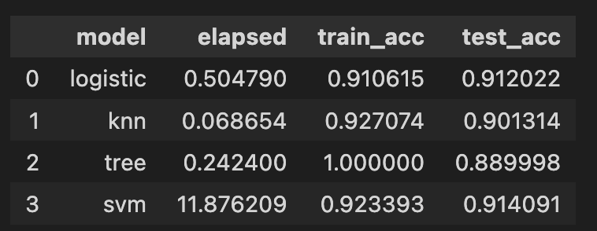
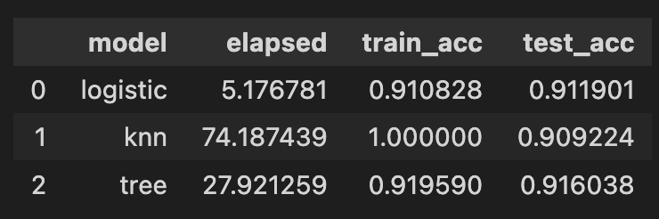

# Comparing Classifiers for a Bank Marketing Campaign

Practical Challenge III

Prepared by Ross Chu

Notebook: [banks.ipynb](./banks.ipynb)

## Introduction

This project trains a variety of classification models to predict successful contacts in marketing campaigns. The client is a financial services provide (Portugese bank), and their business objective is to build a model that predicts a successful marketing contact, defined as a contacted individual subscribing to a term deposit. The client aims to target the most promising individuals for the marketing campaign (those who are most likely to become their customers).

## Exploratory Data Analysis

The target variable is a binary indicator that equals 1 if the individual subscribed to a term deposit. 11% of individuals subscribed to a term deposit, which indicates some degree of class imbalance (although not too severe).

The data contain 10 numerical covariates and 10 categorical covariates. The data does not contain missing values, but there are  unusual groups that appear to be outliers for some categorical columns. Otherwise, there were no concerning outliers or problematic values, 

`pdays` is the number of days since the client was last contacted from a previous campaign follows a special coding rule: 999 is recorded when the client has never been contacted before, which corresponds to the majority of obsevations. This column was recoded in the following way: all non-999 values have been shifted by 1, so that "number of days since" is inclusive of the contact date (starts from 1). If the client has never been contacted before, this value is zero. Due to a large mass of observations at zero, successful contacts likely does not have a linear relationship with this column. Accordingly, it will be important to consider non-linear relationships for this column. 

## Data Preparation

Data were split into 80% training and 20% test sets. To avoid leakage between training and test data, standard scaling for numeric features (mean 0 variance 1) are part of the model estimation pipeline. Categorical features have been one-hot encoded, which is also part of the pipeline. 

## Performance Metrics

The binary classification task is to predict whether a contacted individual subscribes to the bank's product (term deposit). Accuracy is the primary metric for performance evaluation, as this reflects the proportion of individuals whose predicted labels are equal to their actual labels. 

A random classifier is used as the baseline model to evaluate performance. This classifier randomly predicts a successful contact at the empirical success rate $p$ observed in the training data. The baseline accuracy is $p^2 + (1-p)^2 = 0.8006$.

## Classification Models

Four models have been considered for this classification task: logistic regression (with L2 regularization), k-nearest-neighbors, decision trees, and support vector machines (SVM). The table below reports on training time (`elapsed`), training accuracy, and test accuracy. 

All models outperform the random classifier baseline. The benchmark accuracy is 0.80, while accuracy for all models are in the 0.90 range (12.5% higher than baseline). SVM has the highest accuracy in test data, but it's training time is significantly higher than the other three models. Given that accuracy is around 90% for all models, these modest improvements probably do not justify significantly longer training time. The decision tree classifier overfits on the training data, which can be seen in perfect training accuracy but lower test accuracy. Logistic regressions and k-nearest-neighbors are better balanced, with test accuracy slightly below training accuracy. However, all accuracy measures are somewhat optimistic due to class imbalance, as most of the accuracy is coming from the negative class (which constitute the majority)

## Parameter Tuning

Fine-tuning hyperparameters with grid search and cross validation improved accuracy for the logistic regression, but not for other models. Hyperparameters were set based on the best accuracy. The following hyperparameters were tuned with grid search:

- Logistic Regression: L2 penalty term
- k-Nearest Neighbors: number of neighbors, weight type, distance type
- Decision Tree: maximum depth, minimum samples for leaf and splits, feature subsampling rates
- Support Vector Machines: skipped, as its compute time is not worth the performance gains

## Recommendations

Considering that all four models outperform the baseline in terms of accuracy, there is a predictable component to whether an individual responds successfully to a marketing campaign or not. The client should use classification models to target the promising individuals who are most likely to become their customers. Support vector machines is not ideal due to its long training time, but other three models are good candidates even without fine-tuning. However, further work is needed to understand the extent to which tuning hyperparameter can enhance model performance. Furthermore, it would be valuable to explore other performance metrics such as AUROC, precision, recall, and F1-scores (which are better at accounting for class imbalance).

